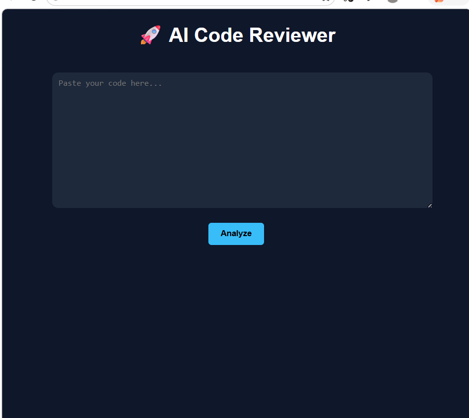
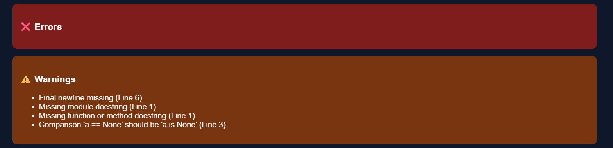
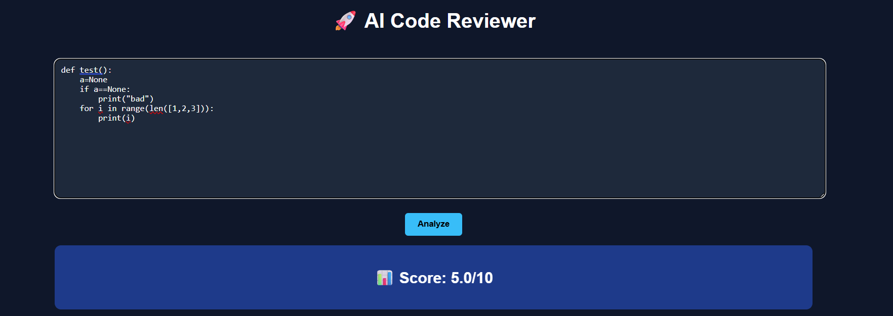
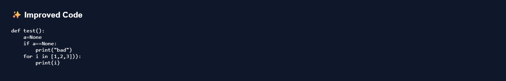

# AI Code Reviewer

A smart AI-powered web application that analyzes Python code, detects errors, and provides intelligent suggestions with a scoring system.

##  Features

- Static code analysis using Pylint  
- Detects errors and warnings  
- Provides improvement suggestions  
- Code quality scoring system  
- Conditional improved code generation  
- Clean and interactive UI  

## Tech Stack

- Python  
- Flask  
- Pylint  
- HTML  
- CSS  

## Screenshots

###  Main Interface

### Output (Errors & Warnings)

### Suggestions

### Score

### Improved Code

## How It Works

1. User pastes Python code  
2. System analyzes code using Pylint  
3. Custom logic generates suggestions  
4. Code is scored based on quality  
5. Improved version is shown (if needed)

## 📂 Project Structure
